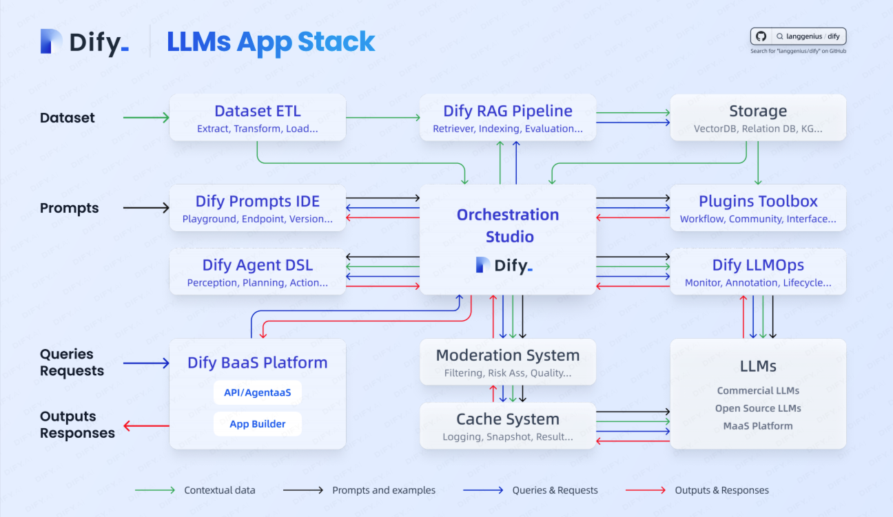

# README

A Big Picture of LLMs Application From dify:

## 1. LLMs Application Stack

- Dataset
  - Dataset ETL
  - RAG Pipeline
  - Storage
- Prompts
  - Playground
  - Templates
  - Endpoint
  - Versions
- Agent
  - Agent DSL
  - Agent Framework
- Plugins Toolbox
- Baas
  - API
  - Agent
  - App Builder 
- Exiting Low Code Builder Integration

